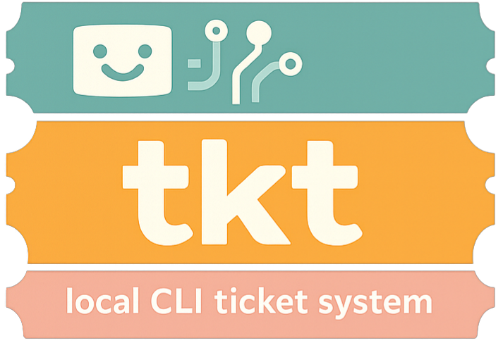

<p align="center">
  
</p>

A project-local CLI ticket system with role-based session isolation and a plan-first workflow. **Built for human + AI agent collaboration.**

tkt is **LLM-CLI agnostic** — it ships an MCP server over stdio so any MCP-compatible tool (Claude Code, Claude Desktop, Cursor, Zed, or your own agent) can drive it without glue code.

<p align="center">
  
</p>

## Install

```bash
go install github.com/zalshy/tkt@latest
```

Or build from source:

```bash
git clone https://github.com/zalshy/tkt
cd tkt
make build     # produces bin/tkt
make install   # installs to $GOPATH/bin
```

## Quick start

```bash
tkt init                          # initialise a project
tkt session --role architect      # declare your role
tkt new "Fix the login bug"       # create a ticket
tkt list                          # see what's open
tkt advance 1                     # move it forward
tkt show 1                        # inspect a ticket
```

## Roles

| Role | Can do |
|---|---|
| `architect` | Create tickets, write and approve plans, verify completed work |
| `implementer` | Pick up planned tickets, implement, submit for review |

Custom roles can be mapped to either built-in: `tkt role create security-expert --like architect`

## Commands

> Full command reference with all flags: [docs/](docs/)

```
tkt init                            Initialise a new project
tkt session                         Show active session
tkt session --role <role>           Start a new session
tkt session --end                   End the current session
tkt new "<title>" [--type <label>] [--attention <N>]   Create a ticket
tkt list                            List open tickets
tkt show <id>                       Show a ticket with full log
tkt advance <id>                    Move a ticket to the next state
tkt plan <id>                       Write or revise a ticket plan (opens $EDITOR)
tkt plan <id> --body/--stdin/--file Supply plan non-interactively
tkt comment <id> "<msg>"            Add a comment to a ticket
tkt depends <id> --on <ids>         Declare ticket dependencies
tkt tier <id> <tier>                Set ticket tier (critical|standard|low)
tkt update <id> [--type <label>] [--attention <N>]  Update ticket type or attention level
tkt context readall/add/update/delete  Manage project context entries
tkt role create/list/delete         Manage custom roles
tkt doc add/list/read/archive       Manage documents
tkt doc add <slug> --body/--stdin/--file  Create a document non-interactively
tkt search <query>                  Substring search across ticket titles and descriptions
tkt log <id> --tokens N             Record token/tool/duration usage against a ticket
tkt archive <id>                    Archive a VERIFIED ticket (terminal state)
tkt cleanup                         Expire stale sessions and run maintenance
tkt monitor                         Read-only TUI dashboard (auto-refreshes every 5s)
tkt mcp                             Start MCP server (stdio transport)
```

## Ticket lifecycle

```
TODO → PLANNING → IN_PROGRESS → DONE → VERIFIED → ARCHIVED
```

### The PLANNING step

PLANNING is the core of tkt's workflow — and what sets it apart from a simple task tracker.

When a ticket enters PLANNING, the architect writes a plan: exact files to touch, function signatures, edge cases, test strategy. No code is written yet. The plan is a contract, not a sketch.

Once written, the plan must be approved by a **different session** before implementation can begin. The state machine enforces this — the same session that wrote the plan cannot advance it to IN_PROGRESS. This is not just a process rule; it is structurally impossible to bypass without a recorded violation.

When the implementer picks up the ticket, the plan is **frozen**. Any deviation during implementation must be logged as a comment explaining why. The architect reviews the final code against the frozen plan at DONE — not against their memory of what they intended.

The result: every piece of work has a written, reviewed, timestamped specification that exists before a single line of code is written. The audit trail is complete and tamper-evident.

```
PLANNING      Implementer picks up + writes plan
                          ↓
IN_PROGRESS   Architect approves
                          ↓
DONE          Implementer executes
                          ↓
VERIFIED      Architect verifies
```

## MCP server

tkt ships a built-in MCP server over stdio, compatible with any MCP-capable LLM tool:

```
command:   tkt
args:      ["mcp"]
transport: stdio
```

Run `tkt init` in a project for the exact snippet to paste into your tool's config.

## License

MIT
