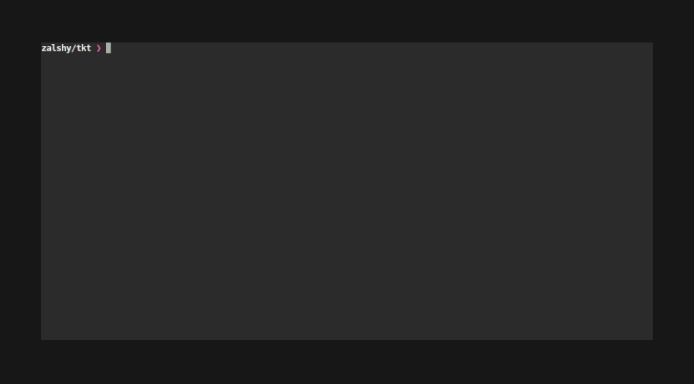

<p align="center">
  
</p>

A project-local CLI ticket system with role-based session isolation and a plan-first workflow. **Built for human + AI agent collaboration.**

tkt is **LLM-CLI agnostic** — it ships an MCP server over stdio so any MCP-compatible tool (Claude Code, Claude Desktop, Cursor, Zed, or your own agent) can drive it without glue code.

<p align="center">
  
</p>

`tkt monitor side` is available since v0.4.0; use it when you want stats and a better at-a-glance view of project progress.

<p align="center">
  
</p>

## Install

```bash
go install github.com/zalshy/tkt@latest
```

Or build from source:

```bash
git clone https://github.com/zalshy/tkt
cd tkt
make build     # produces bin/tkt
make install   # installs to $GOPATH/bin
```

## Quick start

```bash
tkt init                          # initialise a project
tkt man minimal                   # read compact workflow/LLM guide
tkt session --role architect      # declare your role
tkt new "Fix the login bug"       # create a ticket
tkt list --all                    # see the board
tkt advance 1 --dry-run           # preflight transition checks
tkt advance 1 --note "start"      # move it forward
tkt show 1                        # inspect a ticket
```

## Roles

| Role | Can do |
|---|---|
| `architect` | Create tickets, write and approve plans, verify completed work |
| `implementer` | Pick up planned tickets, implement, submit for review |

Custom roles can be mapped to either built-in: `tkt role create security_expert --like architect` (names must match `[a-z][a-z0-9_]*` — no hyphens)

### Orchestrator

`orchestrator` is a built-in role — no `tkt role create` needed.

```bash
tkt session --role orchestrator
```

Orchestrator cannot act in its own name. Every write operation must be delegated to an existing active architect or implementer session using `--as`:

```bash
tkt advance <id> --as <session-name> --note "<note>"
```

`--as` must name an active session with role `architect` or `implementer`. The ticket log records the delegated session — the orchestrator is invisible in the audit trail. Omitting `--as` when running as orchestrator is a hard error.

### Concurrent agents in the same project

`.tkt/session` is a single file pointer per project directory. If an orchestrator and the subagents it spawns all run `tkt` in the same directory, concurrent `tkt session --role X` calls race and silently overwrite each other's effective identity. Use the global `--session <id-or-name>` flag to resolve a specific session directly from the database for one invocation, bypassing the file pointer entirely:

```bash
tkt --session <id-or-name> advance <id> --note "<note>"
```

`--session` accepts either a session's ULID or its generated name, and is additive — omit it and behavior is unchanged. It's orthogonal to `--as`: `--session` controls which session resolves *you*; `--as` lets an orchestrator session act *as* another role. See [docs/global-flags.md](docs/global-flags.md).

### Orchestrator

`orchestrator` is a built-in role — no `tkt role create` needed.

```bash
tkt session --role orchestrator
```

Orchestrator cannot act in its own name. Every write operation must be delegated to an existing active architect or implementer session using `--as`:

```bash
tkt advance <id> --as <session-name> --note "<note>"
```

`--as` must name an active session with role `architect` or `implementer`. The ticket log records the delegated session — the orchestrator is invisible in the audit trail. Omitting `--as` when running as orchestrator is a hard error.

## Commands

> Full command reference with all flags: [docs/](docs/)

```
tkt init                            Initialise a new project
tkt session                         Show active session
tkt session --role <role>           Start a new session
tkt session --end                   End the current session
tkt new "<title>" [--description-file file.md] [--type <label>] [--attention <N>]   Create a ticket
tkt list [--json]                   List open tickets
tkt show <id> [--json]              Show a ticket with full log
tkt man [page]                      Read built-in manuals (`tkt man minimal` for LLMs)
tkt advance <id> --note/--note-file/--note-stdin  Move a ticket to the next state
tkt advance <id> --dry-run/--explain  Preflight or explain transition checks
tkt plan <id>                       Write or revise a ticket plan (opens $EDITOR)
tkt plan <id> --body/--stdin/--file Supply plan non-interactively
tkt comment <id> "<msg>"            Add a comment to a ticket
tkt comment <id> --body-file file.md Add shell-safe multiline comments
tkt depends <id> --on <ids>         Declare ticket dependencies
tkt tier <id> <tier>                Set ticket tier (critical|standard|low)
tkt update <id> [--type <label>] [--attention <N>]  Update ticket type or attention level
tkt context readall/add/update/delete  Manage project context entries
tkt role create/list/delete         Manage custom roles
tkt doc add/list/read/archive       Manage documents
tkt doc add <slug> --body/--stdin/--file  Create a document non-interactively
tkt search <query>                  Substring search across ticket titles and descriptions
tkt log <id> --tokens N             Record token/tool/duration usage against a ticket
tkt stats [--window 7d] [--json]    Show activity-based project statistics
tkt archive <id>                    Archive a VERIFIED ticket (terminal state)
tkt cleanup                         Expire stale sessions and run maintenance
tkt monitor                         Read-only TUI dashboard (auto-refreshes every 3s)
tkt mcp                             Start MCP server (stdio transport)
```

## Built-in manuals

`tkt man` lists built-in reference pages embedded in the binary. Use `tkt man minimal` (or `tkt man llm`) for compact bootstrap guidance, then read specific pages such as `tkt man workflow`, `tkt man state-machine`, `tkt man advance`, or `tkt man stats`.

`tkt doc` is separate: it manages project-local long-form documents in `.tkt/docs/`.

## Ticket lifecycle

```
TODO → PLANNING → IN_PROGRESS → DONE → VERIFIED → ARCHIVED
```

### The PLANNING step

PLANNING is the core of tkt's workflow — and what sets it apart from a simple task tracker.

When a ticket enters PLANNING, the architect writes a plan: exact files to touch, function signatures, edge cases, test strategy. No code is written yet. The plan is a contract, not a sketch.

Once written, the plan must be approved by a **different session** before implementation can begin. The state machine enforces this — the same session that wrote the plan cannot advance it to IN_PROGRESS. This is not just a process rule; it is structurally impossible to bypass without a recorded violation.

When the implementer picks up the ticket, the plan is **frozen**. Any deviation during implementation must be logged as a comment explaining why. The architect reviews the final code against the frozen plan at DONE — not against their memory of what they intended.

The result: every piece of work has a written, reviewed, timestamped specification that exists before a single line of code is written. The audit trail is complete and tamper-evident.

```
PLANNING      Implementer picks up + writes plan
                          ↓
IN_PROGRESS   Architect approves
                          ↓
DONE          Implementer executes
                          ↓
VERIFIED      Architect verifies
```

## Stats

`tkt stats` shows activity-based project analytics: overview counts, cycle time, throughput, resource burn, and distribution by status/tier/type.

With no flags, stats analyzes the last 24 hours of activity across all ticket types and statuses. `--since` and `--until` filter by activity time, not ticket creation time.

```bash
tkt stats
tkt stats --window 7d
tkt stats --since 2026-04-01 --until 2026-04-25
tkt stats --type feature --verified
tkt stats --json
```

## MCP server

tkt ships a built-in MCP server over stdio, compatible with any MCP-capable LLM tool:

```
command:   tkt
args:      ["mcp"]
transport: stdio
```

Run `tkt init` in a project for the exact snippet to paste into your tool's config.

The MCP server exposes read tools such as `tkt_list_tickets`, `tkt_show_ticket`, `tkt_search_tickets`, `tkt_stats` (including `window`), `tkt_list_man_pages`, and `tkt_read_man_page`, plus write/admin tools when not started with `--readonly`.

## Development setup

After cloning, install the pre-push Git hook (one-time per clone):

```bash
make install-hooks
```

The hook runs `go test ./...` before every push and blocks the push if any unit test fails.

## License

MIT
